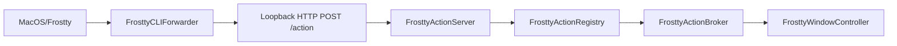

# Frostty Actions

Frostty exposes app-specific commands that external tools (yazi, neovim, shell scripts) can invoke while Frostty is running.

## CLI syntax

```bash
Frostty +action_name [args]
Frostty --help
Frostty +action_name --help
```

Install with `./scripts/install.sh` (builds `Frostty.app`).

The bundle ships a single executable: `Frostty.app/Contents/MacOS/Frostty`. Invoking it with `+action` arguments runs `FrosttyCLIForwarder` in `main.swift`, which forwards to the running instance and exits before starting the GUI — the same model as Ghostty's `ghostty +action`.

Actions use a `+` prefix. Arguments follow an argparse-style model:

- **Positional** parameters are declared per order.
- **Named** parameters use `--key value` or `--key=value`.
- Boolean flags may be passed as `--flag`, `--flag=true`, or `--no-flag`.

## How this differs from Ghostty

Ghostty ships **one binary** (`Ghostty.app/Contents/MacOS/ghostty`). CLI actions (`ghostty +version`) are handled **inside that binary** before the GUI starts, then the process exits.

Frostty uses the same single-binary entry point. Actions like `+markdown_preview` target live UI state (overlay, tabs, focused pane), so those invocations are forwarded over loopback HTTP to the running app instead of executing entirely in the CLI process.

| | Ghostty | Frostty |
|---|---------|---------|
| App executable | `ghostty` | `Frostty` |
| CLI entry | same binary | same binary (`MacOS/Frostty`) |
| `/Applications` on PATH | No (not by default) | No |
| How shell finds CLI | `GHOSTTY_BIN_DIR` + shell integration | Full path to app bundle, or add `MacOS` to PATH |

`Frostty +action` does not launch a second GUI instance — the binary forwards to the running app and exits.

## Architecture



When Frostty launches, `FrosttyActionServer` listens on loopback (default port `41850`, with fallbacks) and writes `~/.config/frostty/frostty.json`:

```json
{
  "port": 41850,
  "pid": 12345
}
```

The CLI reads `frostty.json` and forwards parsed invocations to the server.

Implementation files:

| File | Role |
|------|------|
| `Frostty/App/main.swift` | Early exit for `+action` via `FrosttyCLIForwarder` |
| `Frostty/Features/Actions/FrosttyActionParser.swift` | Arg parsing + CLI forwarder |
| `Frostty/Features/Actions/FrosttyActionServer.swift` | Loopback HTTP server |
| `Frostty/Features/Actions/FrosttyActionBroker.swift` | Routes to frontmost window |

## Adding a new action

1. Define a `FrosttyActionDefinition` with parameter schema.
2. Register a handler in `AppDelegate.registerFrosttyActions()`.
3. Document CLI usage in this file.

Handlers receive a `FrosttyActionInvocation` (`action` + string `args` dictionary) and return `FrosttyActionResult`.

## `+markdown_preview`

| Parameter | Kind | Required | Description |
|-----------|------|----------|-------------|
| `path` | positional `0` or `--path` | No | Markdown file to preview |

Behavior:

- Valid markdown path → open/switch preview overlay.
- Missing/invalid/non-markdown path → reopen last previewed file for the active tab.
- Alt+P (in-app) toggles dismiss when the overlay is already open.

See [MarkdownPreview.md](../MarkdownPreview/MarkdownPreview.md) for overlay behavior, shortcuts, and rendering.
