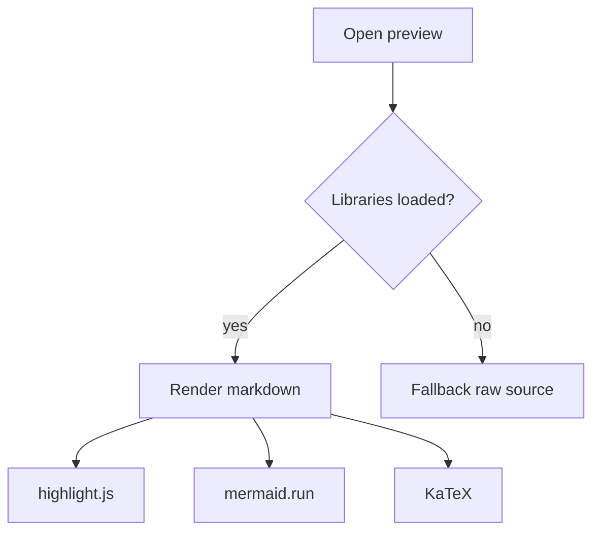
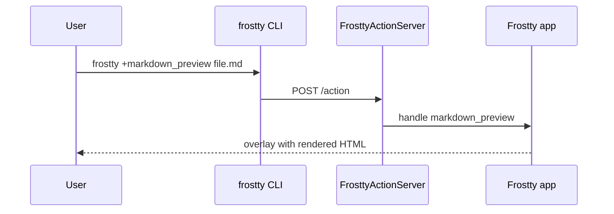

# Markdown Preview Gallery

Use this document to validate rendering, syntax highlighting, Mermaid, math, theme colors, and preview shortcuts.

**Shortcuts to try:** `Esc` close · `hjkl` scroll · `gg` / `G` top/bottom · `r` reload · `/` search · `n` / `N` next/prev match

---

## Headings

# Heading 1
## Heading 2
### Heading 3
#### Heading 4
##### Heading 5
###### Heading 6

---

## Text emphasis

Plain paragraph with **bold**, *italic*, ***bold italic***, ~~strikethrough~~, `inline code`, and a [link to Frostty](https://github.com).

> Blockquote level 1
>
> > Nested blockquote with **bold** and `code`.

---

## Lists

### Unordered

- Alpha
- Bravo
  - Bravo one
  - Bravo two
- Charlie

### Ordered

1. First
2. Second
3. Third
   1. Third A
   2. Third B

### Task list (GFM)

- [x] Syntax highlighting works
- [x] Mermaid renders
- [ ] Images load from remote URLs
- [ ] Search highlights all terms

---

## Tables

| Language | Highlight | Notes |
|----------|-----------|-------|
| Swift | `func main()` | App code |
| Python | `def main()` | Scripts |
| JavaScript | `const x = 1` | Preview page |
| Rust | `fn main()` | Systems |

Alignment:

| Left | Center | Right |
|:-----|:------:|------:|
| L1 | C1 | R1 |
| L2 | C2 | R2 |

---

## Code blocks (syntax highlighting)

### Swift

```swift
import Foundation

@MainActor
func greet(name: String) async throws {
    let message = "Hello, \(name)!"
    print(message)
}
```

### Python

```python
from dataclasses import dataclass

@dataclass
class Point:
    x: float
    y: float

def distance(a: Point, b: Point) -> float:
    return ((a.x - b.x) ** 2 + (a.y - b.y) ** 2) ** 0.5
```

### JavaScript

```javascript
function debounce(fn, ms) {
  let timer;
  return (...args) => {
    clearTimeout(timer);
    timer = setTimeout(() => fn(...args), ms);
  };
}

window.frosttyPreview?.openSearch();
```

### Rust

```rust
fn fibonacci(n: u32) -> u64 {
    match n {
        0 => 0,
        1 => 1,
        _ => fibonacci(n - 1) + fibonacci(n - 2),
    }
}
```

### Shell

```bash
frostty +markdown_preview Frostty/Features/MarkdownPreview/Fixtures/preview-gallery.md
```

### JSON

```json
{
  "port": 41850,
  "pid": 12345
}
```

### Plain / no language

```
no language tag — should still render as a code block
with monospace font and surface background
```

---

## Mermaid

### Flowchart



### Sequence diagram



---

## Math (KaTeX)

Inline: $E = mc^2$ and $\sum_{i=1}^{n} i = \frac{n(n+1)}{2}$.

Display:

$$
\int_{-\infty}^{\infty} e^{-x^2}\, dx = \sqrt{\pi}
$$

---

## Horizontal rule

Above the rule.

---

Below the rule.

---

## HTML (inline)

<details>
<summary>Click to expand HTML details</summary>

<p>This block uses raw HTML inside markdown. It should inherit theme colors.</p>

</details>

---

## Images


---

## Search targets

Repeat these words to test in-preview search (`/` then type):

- **frostty**
- **highlight**
- **mermaid**
- **tokyo-night**

---

## Footnotes

Here is a sentence with a footnote.[^note]

[^note]: Footnote body — support depends on the markdown parser.

---

## Definition-style list

Term one
: Definition for term one.

Term two
: Definition for term two with **emphasis**.

---

*End of gallery. Reload with `r` after editing this file.*
