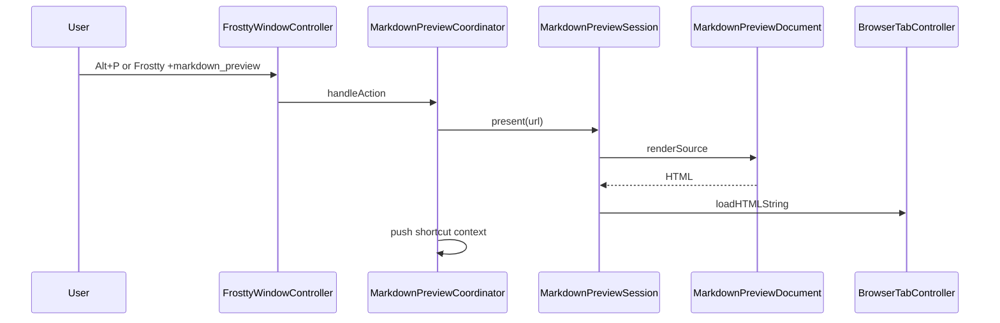

# Markdown Preview

Native markdown preview overlay rendered in an embedded `WKWebView` (marked, highlight.js, mermaid, KaTeX).

## Components

| Type | File | Responsibility |
|------|------|----------------|
| Coordinator | `MarkdownPreviewCoordinator.swift` | Open/close/toggle, shortcut contexts, focus, tab/pane lifecycle |
| Session | `MarkdownPreviewSession.swift` | Overlay state, file polling, reload |
| Document | `MarkdownPreviewDocument.swift` | Markdown → HTML, theme CSS, `window.frosttyPreview` JS |
| Shortcuts | `MarkdownPreviewShortcutContext.swift`, `MarkdownPreviewSearchShortcutContext.swift` | Keyboard bindings |
| Overlay UI | `MarkdownPreviewOverlayView.swift` | SwiftUI chrome over the web view |
| Action | `Actions/MarkdownPreviewAction.swift` | `+markdown_preview` handler |

`FrosttyWindowController` owns a `MarkdownPreviewCoordinator` and implements `MarkdownPreviewHost` for tab/window/focus callbacks. It does not contain preview shortcut or search logic directly.

## Session lifecycle

`MarkdownPreviewSession` polls the source file every 800ms and reloads when the signature (mtime/size) changes.

Closing the source tab, detaching the source pane, or switching away from the source tab dismisses the overlay and pops shortcut contexts.

## Invocation

| Source | Entry | Behavior |
|--------|-------|----------|
| Keyboard | Alt+P | Toggle overlay; reopen last file for active tab when no path |
| CLI | `Frostty +markdown_preview [--path PATH]` | Open or switch file; see [Actions.md](../Actions/Actions.md) |
| Fixture | `Fixtures/preview-gallery.md` | Visual regression gallery for styling and shortcuts |

Requires a focused terminal pane in the active tab. The last previewed path is stored per tab (`Tab.markdownPreviewSourcePath`).

## Keyboard shortcuts

Bindings are registered via `ShortcutContextController` while the overlay is open. See [ShortcutContexts.md](../../Input/ShortcutContexts.md) for stack behavior and chord rules.

| Key | Action |
|-----|--------|
| Esc | Dismiss preview |
| h / j / k / l | Scroll preview |
| gg | Scroll to top (leader chord: `g` then `g`) |
| G (Shift+g) | Scroll to bottom |
| r | Reload preview |
| / | Open in-page search |

### Search

Search uses a stacked sub-context on top of the preview context:

| Phase | Keys | Action |
|-------|------|--------|
| Typing (`passesTextInput`) | printable | Type into search bar |
| Typing | Enter | Commit query, enable match navigation |
| Typing | Esc | Dismiss search |
| Navigation | n / N | Next / previous match |
| Navigation | Esc | Dismiss search and clear highlights |

Clicking the search bar or pressing `/` again after navigation resumes typing. Search matches visible rendered text only (excludes `pre`, `code`, mermaid, KaTeX blocks). Substring match, not whole-word.

## JavaScript bridge

The generated HTML exposes `window.frosttyPreview`:

| Method | Purpose |
|--------|---------|
| `scrollBy(dx, dy)` | Smooth scroll |
| `scrollToTop()` / `scrollToBottom()` | Jump to document ends |
| `openSearchAndFocus()` | Show search bar and focus input |
| `commitSearchTyping()` | Apply query, blur input, keep bar visible |
| `resumeSearchTyping()` | Re-focus search input after navigation |
| `dismissSearch()` | Hide bar and clear highlights |
| `findNext()` / `findPrevious()` | Navigate committed search matches |

`BrowserTabController` receives `searchInputFocus` bridge messages to resume the typing sub-context when the user clicks the search field.

## Theming

`MarkdownPreviewTheme.live()` reads the resolved Ghostty config (including `theme = Tokyo Night Storm` and bundled theme files):

- Foreground, background, palette-driven heading colors
- Hardcoded bold accent (`#58b99d`)
- Mixed surfaces for code and Mermaid containers (`--surface`)
- Minimum preview font size: 18pt (`MarkdownPreviewDocument.minimumPreviewFontSize`)

Config changes trigger a reload via `.ghosttyConfigChange`.

## Syntax highlighting

Code fences use highlight.js with the Tokyo Night Dark token theme. Mermaid blocks are excluded from highlighting and rendered separately.
