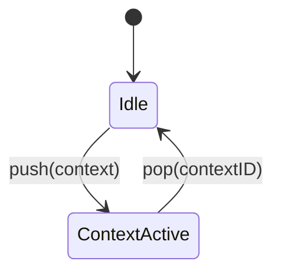

# Shortcut Contexts

Shortcut contexts let Frostty features register temporary keyboard bindings without polluting global shortcuts.

## Lifecycle



`ShortcutContextController` maintains a **stack** of contexts. The top context is active. Features may push nested sub-contexts (markdown preview search typing is the first example).

## Context properties

| Property | Purpose |
|----------|---------|
| `blockFallback` | When `true`, global shortcuts are blocked except those marked `allowWhenSuppressed` (e.g. Alt+P). |
| `passesTextInput` | When `true`, printable keys pass through to the first responder unless they match a context shortcut. |
| `shortcuts` | Immediate key bindings for the context. |
| `chordKeyCode` | Leader key that arms chord completion. |
| `chordShortcuts` | Bindings matched by the **second** key press within the chord timeout. |

## Chord sequences

Chords use a **leader key** model (vim-style):

1. Press the leader (`chordKeyCode`, e.g. `g`) — consumed, arms a 400ms window.
2. Press a second key — if it matches an entry in `chordShortcuts`, that shortcut fires.

The second key may be the same as the leader (`gg`) or different (`gk`). The same physical key-down event cannot complete a chord (prevents double-dispatch from WebKit).

While a context with `passesTextInput` is on top of the stack, chord handling is disabled so printable keys reach the search field.

Example registration:

```swift
ShortcutContextController.Context(
  blockFallback: true,
  shortcuts: [...],
  chordShortcuts: [
    ShortcutManager.Shortcut(modifiers: [], keyCode: 5, ...)  // gg → scroll to top
  ],
  chordKeyCode: 5  // leader: g
)
```

To add `gk`, include another `chordShortcuts` entry with `keyCode` for `k`.

## Routing

`ShortcutManager` consults the context controller before global shortcuts:

1. Handle chord arming/completion.
2. Match context shortcuts on the active (top) context.
3. If `passesTextInput`, deliver unmatched keys to the first responder.
4. If `blockFallback`, only allow global shortcuts with `allowWhenSuppressed`.

`matchEvent` caches results per `KeyEventIdentity` (timestamp, keyCode, window, modifiers, repeat flag) so a single key-down is not routed twice when WebKit and AppKit both deliver it.

## Clients

| Feature | Context type | File |
|---------|--------------|------|
| Markdown preview | Main + search sub-contexts | `MarkdownPreviewShortcutContext.swift`, `MarkdownPreviewSearchShortcutContext.swift` |

Preview shortcuts call `window.frosttyPreview` JavaScript helpers in the rendered HTML via `evaluateJavaScript`.

### Markdown preview bindings

| Key | Action |
|-----|--------|
| Esc | Dismiss preview |
| h / j / k / l | Scroll preview |
| gg | Scroll to top |
| G | Scroll to bottom |
| r | Reload preview |
| / | Open in-page search |

Search sub-context behavior is documented in [MarkdownPreview.md](../Features/MarkdownPreview/MarkdownPreview.md).
